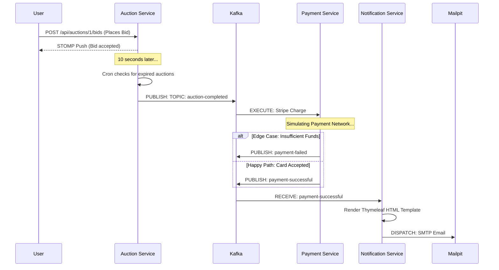

# System Architecture Diagram

This document contains Mermaid diagrams visualizing the structure and data flow of the AuctionX platform. Native Markdown rendering handles these diagrams.

## High-Level Component Architecture
Visualizing the physical boundaries of our services and their mapped databases.

```mermaid
graph TD
    Client[Web/Mobile Client]
    
    subgraph "Core API Layer (Port 8080)"
    AuctionX[auctionx (Core Engine)]
    end
    
    subgraph "Background Microservices"
    Payment[payment-service (Port 8081)]
    Notification[notification-service (Port 8082)]
    end
    
    subgraph "Data & Infrastructure Layer"
    PG[(PostgreSQL)]
    Redis[(Redis Cache)]
    Kafka{{Apache Kafka}}
    SMTP[Mailpit SMTP]
    end

    Client -- REST / WebSockets --> AuctionX
    AuctionX -- R/W --> PG
    AuctionX -- R/W --> Redis
    
    AuctionX -- Publishes 'auction-completed' --> Kafka
    Kafka -- Consumes 'auction-completed' --> Payment
    Payment -- Publishes 'payment-successful' --> Kafka
    Kafka -- Consumes 'payment-successful' --> Notification
    Notification -- Sends HTML Email --> SMTP
```

## Event-Driven Sequence Flow
Visualizing the exact chronological flow of an auction ending.


